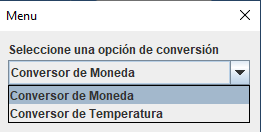
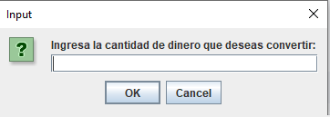
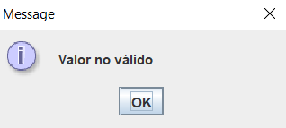
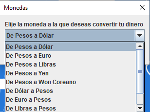
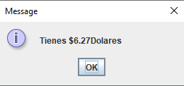
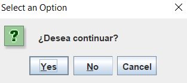
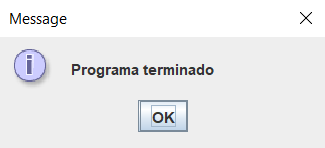

# Desafío Conversor de Monedas

## **ÍNDICE**

* [1. Intro](README.md#1-intro)
* [2. Qué construí](README.md#2-qué-construí)
* [3. Objetivo del Proyecto](README.md#3-objetivo-del-proyecto)

****

## 1. Intro

Este proyecto creado para la segunda etapa de OracleONE, se basa en la creación de un conversor de unidades, principalmente de divisas. En esta ocasión seleccione como opción extra la conversión de temperatura.
Los valores de las divisas fueron: Pesos Mexicanos, Dólar Estadounidense, Euro, Libra Esterlina, Yen Japonés y Won Surcoreano. Mientras que en la sección de temperatura fueron: Celsius (ºC), Fahrenheit (ºF) y Kelvins (K).

## 2. Qué construí

En este proyecto el enfoque fue construir un menu donde se mostraran las opciones de conversion a las que tenia acceso el usuario, tal como se puede apreciar en la siguiente imagen.

Después de seleccionar alguna opción se visualizaria una ventana emergente para ingresar el valor a convertir. En caso de haber ingresado un valor que no fuera numerico apareceria un mensaje advirtiendo al usuario.

Enseguida se mostrarian las distintas opciones de conversión de las divisas que se podian realizar y al seleccionar alguna apareceria una ventana con el valor total de la conversion.

Para finalizar aparece una ventana dando la opcion al usuario de seguir usando el programa o cerrarlo, si el usuario da clic en el boton de "Yes" volvera al menu del inicio y si da clic en cualquiera de los otros dos botones restantes, aparecera un mensaje advirtiendo al usuario que el programa ha finalizado.

## 3. Objetivo del Proyecto

Implementar los conocimientos obtenidos a lo largo de los cursos brindados por la plataforma de Alura Latam, conocimiento anteriormente obtenido e incluso habilidades de busqueda en otros sitios/plataformas, ésto para encontrar soluciones eficientes para los retos que se presentaron en el desarrollo.
